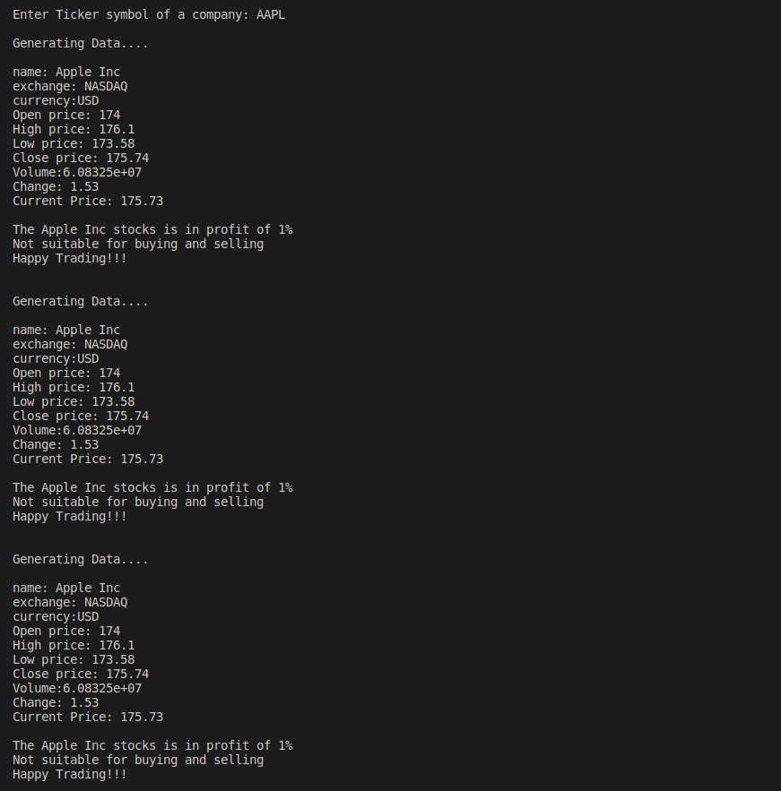

# Trading-App

A prototype of Trading app.

Users gets real time data of company's stock from Ticker symbol over every 3 millisecond and if the stock price is suitable for buying and selling then it will send signal to buy or sell in stock according to user's limit of amount of stocks, User also get cost of stock from current price if signal send.

## Built With

C++ STL

## Getting Started

Download or clone this repo by using git clone https://github.com/Vidhi0229/Trading-App.git
Enter the project folder and run locally by using a VS Code with this command: g++ -o "output file name" main.cpp curl_functions.cpp functions.cpp -lcurl -ljsoncpp

## Pre-requisites
- Install curl library for making HTTP requests
- Install JsonCpp library for JSON parsing and manipulation in C++
- Sign up https://twelvedata.com/stocks to get your own API key
- Put your api key to config.json file.

## Authors 👤

### Vidhi Srivastava

_[Github](https://github.com/Vidhi0229)

_[LinkedIn](https://www.linkedin.com/in/vidhisrivastava01/)

## Show your support ⭐️⭐️

Give a star if you like this project!

## License 📝

This project is [MIT](https://www.mit.edu/~amini/LICENSE.md) licensed.